# Levela Portal 構造図

## Mermaid ダイアグラム

```mermaid
graph TD
    Root[🏠 Levela Portal]

    %% セクション
    S1[📁 Levela全体]
    S2[📁 部署]
    S3[📁 事業]
    S4[📁 マニュアル]
    S5[📁 インテリジェンス]
    S6[📁 その他]

    Root --> S1
    Root --> S2
    Root --> S3
    Root --> S4
    Root --> S5
    Root --> S6

    %% Levela全体
    S1 --> L1[📄 全体会議議事録]
    S1 --> L2[📄 Levelaメンバー紹介]
    S1 --> L3[📄 LevelaのMVV]
    S1 --> L4[📄 Levelaオンライン図書館]

    %% 部署
    S2 --> D1[📄 CS部]
    S2 --> D2[📄 マーケティング部]
    S2 --> D3[📄 工事中🚧マーケティング部]
    S2 --> D4[📄 営業ポータル]
    S2 --> D5[📄 社長室ポータル]
    S2 --> D6[📄 クリエイティ部]
    S2 --> D7[📄 知足ポータル]
    S2 --> D8[📄 TikTok Shopマネタイズ講座ローンチ]
    S2 --> D9[📄 AI Brain 知識ベース]

    %% 事業
    S3 --> B1[📄 新規事業_Monthly会議]
    S3 --> B2[📄 運用代行]
    S3 --> B3[📄 AI教育事業]
    S3 --> B4[📄 Mrs.PROTEIN]
    S3 --> B5[📄 ダイエット事業]
    S3 --> B6[📄 アイレポート]
    S3 --> B7[📄 営業代行事業]
    S3 --> B8[📄 コーチングスクール事業]
    S3 --> B9[📄 TikTokライブスクール]
    S3 --> B10[📄 各事業計画]
    S3 --> B11[📄 UGC]

    %% マニュアル
    S4 --> M1[📄 採用決定後のフロー]
    S4 --> M2[📄 業務対応マニュアル]
    S4 --> M3[📄 ナレッジ共有]
    S4 --> M4[📄 週次/月次入力フォーマット]
    S4 --> M5[📄 SnsClub講師紹介制度について]

    %% インテリジェンス
    S5 --> I1[📄 教材格納庫]
    S5 --> I2[📄 AIスクール用動画]
    S5 --> I3[📊 AI活用事例ナレッジDB]
    S5 --> I4[📄 開発ツール]

    %% その他
    S6 --> O1[📄 クライアントワークの報酬設定]
    S6 --> O2[📄 カウンセリングメンバー募集]

    %% スタイル
    classDef section fill:#8b5cf6,stroke:#333,color:#fff
    classDef root fill:#e94560,stroke:#333,color:#fff
    classDef page fill:#1e3a5f,stroke:#333,color:#fff
    classDef database fill:#1a4a1a,stroke:#333,color:#fff

    class Root root
    class S1,S2,S3,S4,S5,S6 section
    class L1,L2,L3,L4,D1,D2,D3,D4,D5,D6,D7,D8,D9,B1,B2,B3,B4,B5,B6,B7,B8,B9,B10,B11,M1,M2,M3,M4,M5,I1,I2,I4,O1,O2 page
    class I3 database
```

## 検証結果サマリー

| 項目 | 状態 | 詳細 |
|------|------|------|
| トップレベル構造 | ✅ 一致 | 38項目すべて確認 |
| セクション分類 | ✅ 一致 | 6セクション |
| 名称差分 | ⚠️ 1件 | コーチング事業 → コーチングスクール事業 |
| 一致率 | 94.4% | 34/36項目 |

Generated: 2026-01-13
