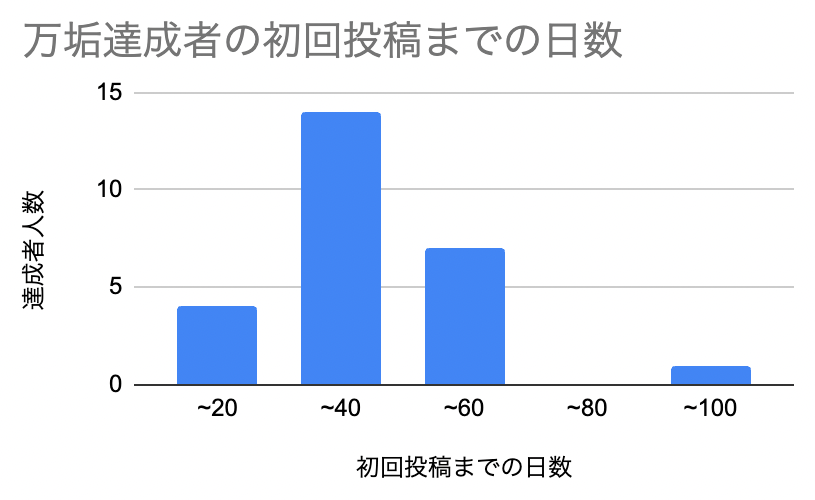
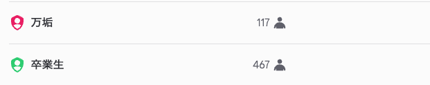
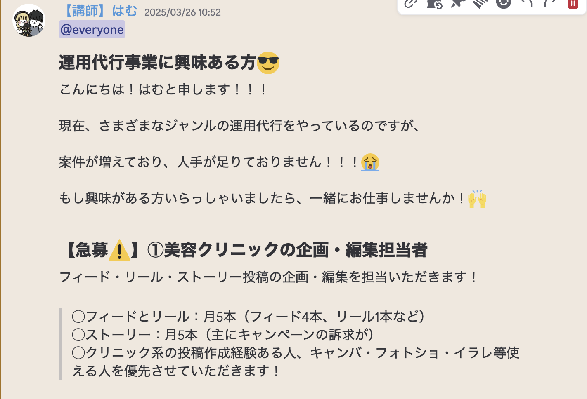
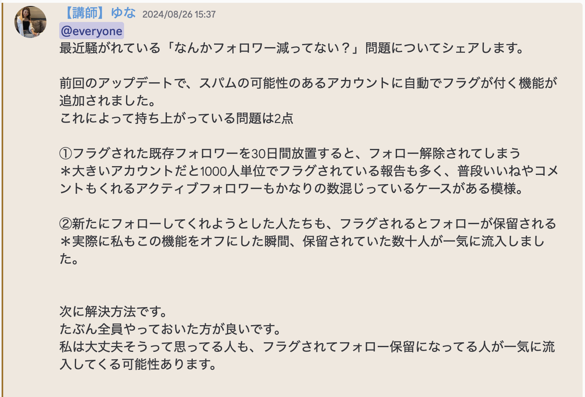
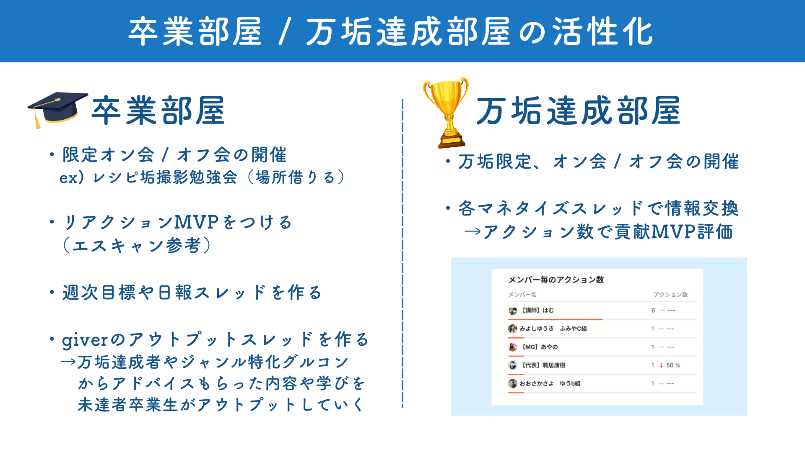

# あかね「CS」

**種類**: 📄 ページ
**階層**: 3
**更新日時**: 2026-01-14 12:09

---

## コンテンツ

# 先月の活動報告
---
### **4月からCS部活動スタートしました！よろしくお願いいたします🙇**

## ◆CS部（サービス改善 / 顧客対応）の目標設定
## 💎Mission（存在意義）
**「そこまでやるか？」をデフォルトに**
---
## 💎Vision（目標）
**卒業率100％を実現する（卒業時に30投稿以上していること）**
---
## 💎Value（行動指針）
**生徒ファースト（生徒の疑問・悩みに迅速対応）**

---

## ◆現状の数値把握

📊 **Untitled** (データベース)

## **〜40日以内（ピーク：14人）**
## **そこから先（〜60・〜80・〜100）になると急激に人数が減少**
## **時間が経つほど行動に移せない**

---

## ◆4ヶ月間の平均アカウント開設率
40日〜160日のクラス人数合計：464人
アカウント開設人数（フォーム提出人数）：218人　　　　　
## **アカウント開設（フォーム提出）率＝218÷416=  46.9%**

## ◆4ヶ月間の平均初回投稿率
40日〜160日のクラス人数合計：464人
40日以内初回投稿人数（生徒管理シートより）：70人　　　　　
## **40日以内初回投稿率＝70÷416= 16.8%**

## ◆4ヶ月間の平均卒業率
卒業予定人数：76人
卒業人数（フォーム提出人数）：56人
**卒業時30投稿以上してる人数：****21名**
## **卒業率＝56÷76=  73.7%**
## **30投稿率＝21÷56=37.5%**

## ◆現状のDiscord卒業部屋
- **人数→万垢114人：卒業生467人**

- **万垢部屋の現状（4月）**
招待された時の自己紹介
勉強会案件のアナウンスと生徒の反応やアウトプット

- **卒業部屋の現状（4月）**
招待されておわりの風潮になっている

【過去】卒業生限定で現役講師からの質問回答会の実施など

# Quarter 目標・達成AP
---

## 目標
- **5月運営の仕組みを整えて、各フォームの提出率を****100％****にする**
- **アカウント提出から40日以内の初回投稿率を****16%→50％****にする**
- **7月までに卒業の段階で万垢未達の生徒を****10名以上****万垢にする**

## 達成AP
### 5月：数値分析のマニュアル化と入会直後の体制を整える
- **入学式**の実装

スクラブロードマップ作成（スタンプラリーかチェックリスト）40日以内に初投稿するのを基準とできるようにポータルに【期間付きのロードマップ】を作る（初回HRから、5week ウィークリーで）

- 各数値分析のマニュアル化
- アカウント提出フォームの提出のルール設定と仕組み化（フォームリストをポータルに入れる）
- ~~お問い合わせ対応のマニュアル化とシフト体制~~
- ~~クラス分けの分担（えるさん）~~
- ~~ジャンル特化グルコンのスタートと改善~~
- ショート動画分析ツールで出た今週のバズショート動画をDiscordで配信する
- 卒業生へニーズ調査をする
- 卒業生限定オフ会
- 実績者からの添削（卒業後は専属講師のサポートがなくなるため）
- 収益化のチャンス

### 6月：卒業生部屋の活性化施策スタート
- 卒業生限定（万垢達成者）オフ会の開催（仮）→特別待遇を増やす

卒業生部屋の活性化施策（仮）

- 初回投稿のハードルが下がるカリキュラム作り（１投稿目は機械的にやらせる）

スタータープログラム改善（完了を全て90%にする）

📄 **スタータープログラムの現在の完了率 (3)** (子ページ)
- 生徒会の考案とタスク細分化
- 卒業生限定のグルコンの開催スタート

### 7月：生徒会Discordの活性化施策スタート
- 卒業生マッチング制度のマニュアル化
- 数値分析と改善
- 他者分析レポートを元にカリキュラム改善
- 生徒会の実装

---

## 子要素一覧

- 📊 [Untitled](./Untitled/index.md)
- 📄 [スタータープログラムの現在の完了率 (3)](./スタータープログラムの現在の完了率 (3)/index.md)

---

## 全子孫構造

このセクション配下の全ページ/データベース（2件）:

  - 📊 Untitled
  - 📄 スタータープログラムの現在の完了率 (3)

---
*Generated: 2026-01-14 12:09*
