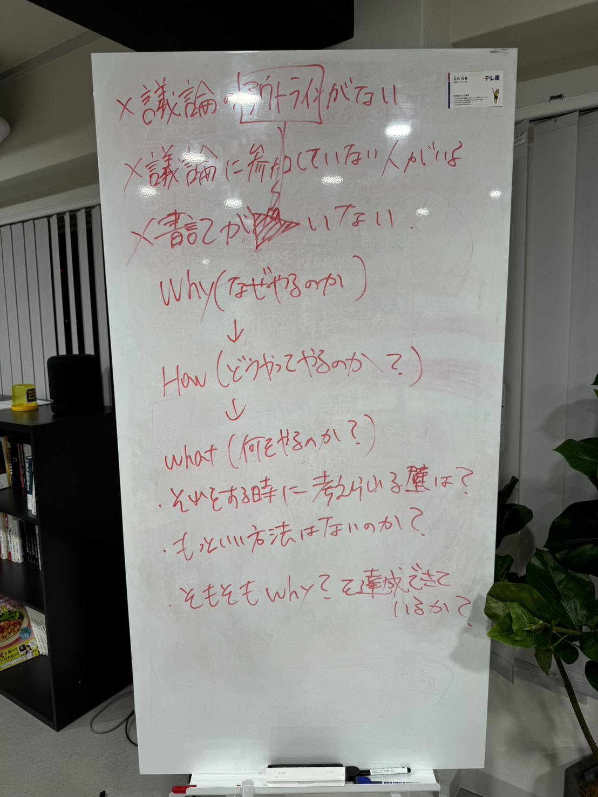

# 2024年7月5日

**種類**: 📄 ページ
**階層**: 2
**更新日時**: 2026-01-14 12:09

---

## コンテンツ

## 資料
[Bookmark: https://www.canva.com/design/DAGJ9QRMK5E/GElm77BVdqQoojURVrO4ow/edit?utm_content=DAGJ9QRMK5E&utm_campaign=designshare&utm_medium=link2&utm_source=sharebutton](https://www.canva.com/design/DAGJ9QRMK5E/GElm77BVdqQoojURVrO4ow/edit?utm_content=DAGJ9QRMK5E&utm_campaign=designshare&utm_medium=link2&utm_source=sharebutton)

## **各事業の進捗報告**
- 運用代行
- 
- アイドマホールディングスの営業代行をお願いしている
- 7月10日ごろからテレアポ開始(年間1.2万件ほどを予定)

- 投稿作成等はSnsClubの生徒へ依頼予定

- SnsClub 講師マネジメント 村松さん
- テンプレの変更は今月以降

- ローンチ結果
- 大きく滑ってしまった
- テンプレが必須だと考えていたが、普段のストーリーとの差が大きかった
- 明らかにローンチの匂いがしている状態
- 流す以外をやってもらえなくなってしまった
- 講師ごとに合ったストーリーのデザインを作成する
- テキストで依頼内容を共有、デザインは参考程度に
- ストーリーの趣旨を伝えた上で共有

- ローンチは重ねるほど上手くなっていく
- 刈り取り切るまでやり切る
- 駒居さんやソウタさんでも最初は1名しか集まらないこともあった
- 今ではセミナーで1000人集まるほど
- アフィと同じ、回数を重ねるほど上手くなる
- 2回目以降の人には必ず伝える (モチベーションが低下しないように)

- 講師トレーニングの参加率が向上
- チャット& 1on1 でのリマインドの結果

- 講師マネージャー増員に向けたローンチのロードマップの作成
- 駒居さんは7月は手伝えない可能性が高い

- 講師マニュアルの作成
- 動画講義が未完成の状態

- マネージャー増員について
- 現状はオフラインでないと厳しい
- コミュニケーションレベルに達している人が少ない
- オンラインとオフラインだと管理が難しい
- オフラインですら大変な状態
- 現状の講師人数→40名ほど
- 40名もいればオンラインの講師でもオフラインで働けるのではないか？
- どうやればオフラインに来てもらえるかを考える
- 現状の講師が対象として当てはまるのではないか
- オフラインに来ることによって新しい仕事を任せられる可能性が高い
- 運用代行のディレクター
- サービス作りなど
- 仕事はいくらでも作れる

- 帰属意識は後からでもOK
- 相手の価値を認めた上で一緒にやりたいと伝える

- 現状各マネージャーが担当しているのは12名ずつ
- エスキャンの東京オフ会はどうか？
- 現状の講師の中からオフラインで参加できる講師を探す
- オフ会などで探す

- 新カリキュラムの動画講義格納について
- すぐに必要な講義
- マネタイズ

- 駒居さんが作る講義
- マネタイズ基礎講義
- 15日に撮影
- アフィリエイト講義
- 17日に撮影

- 駒居さん以外でもいい講義
- Canvaの使い方講義
- ソンイさんのCanva講座を講義として格納
- CapCutの講義など
- 基本機能の解説 (30分ほど)
- 投稿作成の流れ
- まめさんのcapcutの講義をベースに作成
- ゆなさんが今月中に作成

- 講師採用 けいさん
- 万垢部屋に流したような講師募集の文章に変更した
- こうしさん→7月

- コーチング ふうかさん

- コーチングチームがどのように動いているか講師が把握できているのか？
- コミットプランの恩恵
- データとして投稿の継続率が上がっている
- 生徒が結果の出やすいサービスになっている
- コミットプランを作った前後でアクティブさが違う(コミットプランの生徒がいるクラス)
- コミットの生徒がアクティブに動いてくれる
- 毎日のように添削が飛んでくる
- その生徒がクラスを引っ張っていってくれる

## **駒居さんから伝えたいこと**
- 採用について
- 現状4名採用 うち3名が営業
- 営業チームを内製化 (8月ごろから)
- 20歳男性、33歳女性、43歳女性
- 全員が営業経験者
- 2人はSnsClubの生徒
- 1名は講師

- 大学生インターンを採用していきたい
- ウォンテッドリーなど
- インターン生を採用する媒体(インフラ)
- インターン生専門だと一番多い

- ソウタさんについて
- 相談などをなくサービスのローンチをしてしまい、SnsClubの生徒も勝手に入会させていた
- 弁護士と相談のもと法的に処理
- 会社とソウタさんで契約書を締結

- もりーについて
- 解雇
- 任せた仕事をやらなかった
- synergyやエスキャンなどの外部の関わる仕事に対して納期を守らない、連絡を飛ぶなどが多かった

- Stripeの凍結について
- 消費者センターへ相談した方がいたことが原因
- 被害額が1500万円ほど
- 本来入金されるはずだった金額
- ロボットペイメントで支払いを飛ぶ方もいる
- 損害額としては3~4000万円ほど

- SnsCoolがなぜ日本一を目指すのか
- SNS業界が盛り上がっている
- 新しい市場が盛り上がるとカオスになる
- SNSコンサルを高価格で売るノウハウが山ほど出ている
- 不幸せな人を増やしてしまっている
- 詐欺のようなことが横行している
- ユーザーのためにならない会社がたくさん出てくる
- SnsClubであれば閉廷できる、する必要がある
- サイバーエージェントのよう(ネット広告)
- SnsCool以上に顧客対応にこだわったスクールはない

- 2周年旅行について
- 1周年は2泊3日で韓国へ
- みんながいきたい国
- ノアさん ハワイ
- 美月さん オーストラリア
- 太一 イギリス
- 村松さん ハワイ
- ゆなさん ハワイ
- こうしさん タイ
- けいさん タイ
- 11月開催の予定

## ワークショップ
- 個人のレベルアップがチームのレベルアップの前提のもとチームとして取り入れる習慣を考える
- 自己研鑽を自己研鑽で終わらせるのはもったい無い

- 美月さん
- 月1ミニマム1冊読書週間
- 1人でやろうとしても続かない
- 本の内容を共通認識として持っておきたい
- 月末までにDiscordに送信
- 未実施だとMVB減点
- ゆなさん
- 知識をインプットしたものをアウトプットする
- 読書に固定しなくてもいいのではないか

- ノアさん
- 個人のSNSスキル向上を目的
- インプットしてよかった情報をアウトプットするスレッドがあってもいいかも
- 会社で保有している無形商材をまとめる
- けいさん
- 問題点から考える必要がある
- マネジメントや採用、帰属意識など
- 自分やSnsCoolにどう落とし込むか
- こうしさん
- アウトプットをしてネクストアクションが必要(行動に落とし込む)
- 中身のないものにしない
- アウトプットした中でどういう人に読んで欲しいのかを記載

## ワークのディスカッション内容
▼定義
できなかったことができること、知らない→知る
▼Why?なぜやるか？：チームとしてのレベルアップとは何か？
個人×個人の力で強くなる
共通認識を合わせて強くなる
▼How?どうやってやるか？：
課題を認識していないとやらない
やったほうが良いという認識は全員あると思う
▼原因
飽きてしまう
集中がもたない
優先度を下げてしまっている
興味ないものは集中できない
▼やるためには
強制力があるか
必要性がないか
▼どうやって強制力をつけていくか
例：まこなりさんではランキングをつける
・読書感想文で点数をつける
・信頼を犠牲にしてやるのか
▼こまいさんの読み方
YouTubeを見る→概要を理解
目次を見る→どこを読むかを取捨選択
本文を読む→知っている箇所は飛ばし・知らない箇所は読む・メモする
▼効果
気づきがある
行動レベルでアウトプットに落とす
知識が増える
▼フォーマット
まこなりさんの読書感想文
刺さったフレーズ2,3個
感想
仕事・プライベートに落とし込めそうなところ
メンバーとディスカッションしたいテーマ
要点・要約
気づき
ネクストアクション
評価・おすすめな人
▼実装者
経費にしたい場合は紙・電子
▼提出に関して
MVBeフォームの期日に提出
会議中にランダムの3名に感想を話す

### ⚠️議論をする時の進め方について（駒居さんより）

---

## 子要素一覧

(子要素なし)

---
*Generated: 2026-01-14 12:09*
