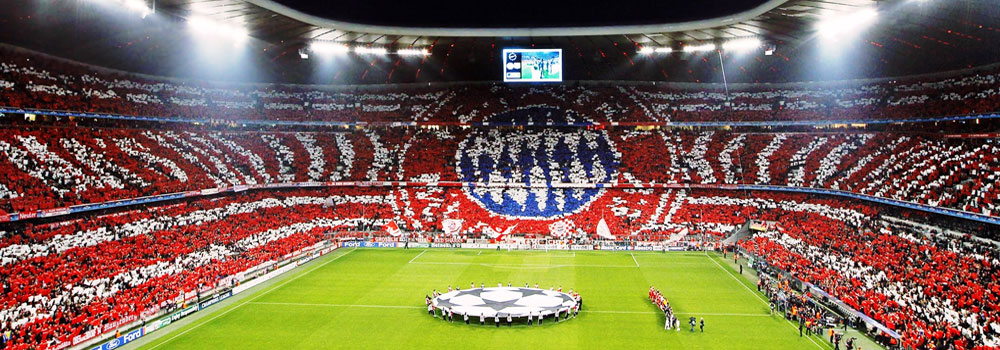

# 太一・ふうか・なお・はるチーム

**種類**: 📄 ページ
**階層**: 3
**更新日時**: 2026-01-14 12:09

---

## コンテンツ

## ■目的地：ドイツ
---

---

## ■予算：25万円
---
航空券　往復20万 （15時間・12時間）、直行便でいける
ヒルトン 4人部屋　4泊20万円 →1人5万円(多めで概算)
## ■目的地・スケジュール

---
### 出国（2/12）

### 世界基準の仮装大会（2/13）
- カーニバル（2/13）：ケルン
└仮装大会　一番いいねがついた人に何かしらご褒美〜⭐️

### **世界トップのサウナ 「SATAMA」（2/14）**
- サウナ集合で夜まで別行動（2/14）：satama　ベルリンで車から1時

### **世界一のサッカー観戦（2/15）**
- バイエルンvs レヴァークーゼン

### 帰国　2/16
## ■駒居さんがワクワクするポイント、メリット
---
1. ご飯が美味しい（ビール🍻・ソーセージ）
1. 観光できる（ノイシュヴァンシュタイン城）
1. 参加型のイベントに行ける
1. サウナがある
1. 直行便

## ■デメリット
---
1. 寒い！絶対寒い　けど汗をかくよりはマシ
1. 多分飛行機でお尻痛くなる

---

## 子要素一覧

(子要素なし)

---
*Generated: 2026-01-14 12:09*
