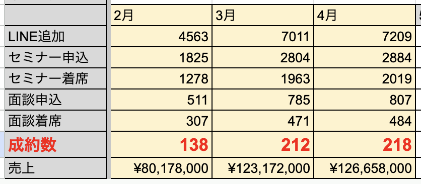

# 太一さん「LINEチーム」

**種類**: 📄 ページ
**階層**: 3
**更新日時**: 2026-01-14 12:09

---

## コンテンツ

## 目標
### 成約数
100%目標：98件
120%目標：116件
## 結果
### 成約 156件 (達成)
内訳
12月セミナー：12人
1月セミナー：144人

### 勉強会詳細数値
流入：3511人
セミナー申し込み：1618人 (46%)
着席：1124人 (69%)
面談申し込み：607人 (54%)
面談着席：358人 (59%) 
成約：144人 (40%)
成約見込み：14人

※基準値↓ 赤文字 基準値↑ 青文字

設定基準値

セミナー申し込み：45%
着席：75%
面談申し込み：45%
面談着席：70%
成約：40%

---

## 子要素一覧

(子要素なし)

---
*Generated: 2026-01-14 12:09*
