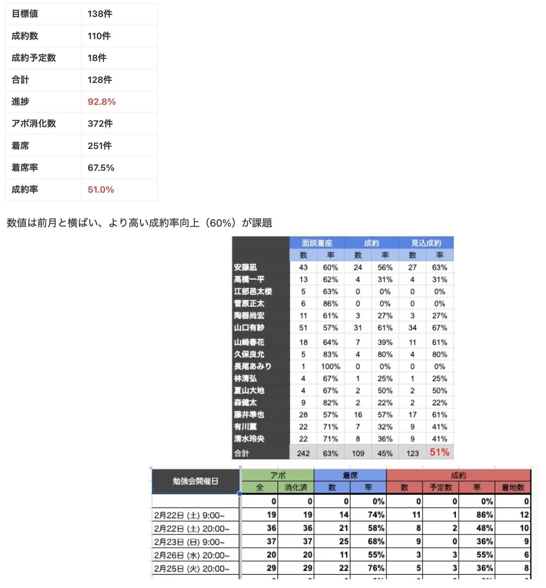

# 凪さん「営業チーム」

**種類**: 📄 ページ
**階層**: 3
**更新日時**: 2026-01-14 12:09

---

## コンテンツ

## 改善策
### １,AI営業最適化システムの構築
- **AIによる営業会話分析**:
- 成功事例（成約）と失敗事例（失注）の営業会話（tldvなど）で記録
- AIによる会話パターン分析と成功要因抽出する
- 会話ごとの成約確度スコアリングと改善ポイントの自動提示できるシステム構築
### 2. 育成AIシステム
- **AIによる営業スキルギャップ分析**:
- 高パフォーマーと新人の営業会話を比較分析
- 差分を数値化・可視化（説得力スコア、顧客理解度、クロージングタイミング等）
- 個人別の弱みに焦点を当ててFBする
- **AI仮想顧客シミュレーター**:
- 様々な顧客タイプと反論パターンをシミュレートするAIツールの構築
- 面談動画を読みこませ、顧客ペルソナを構築する

---

## 子要素一覧

(子要素なし)

---
*Generated: 2026-01-14 12:09*
