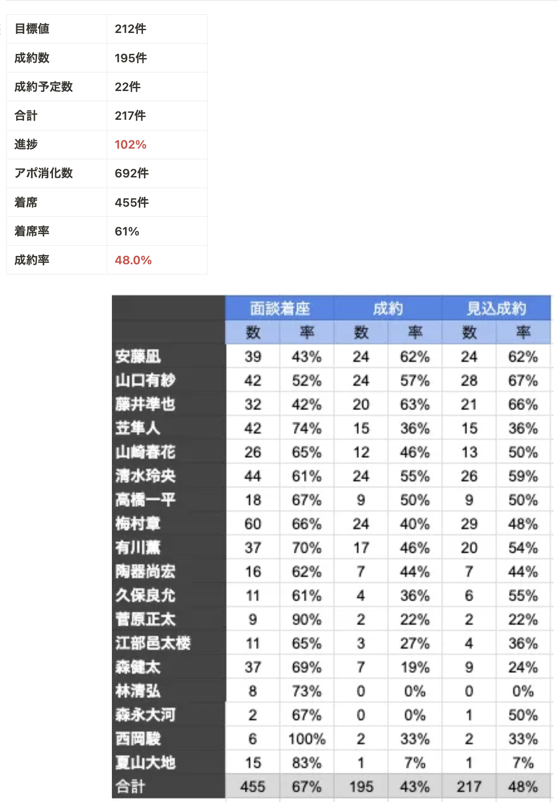
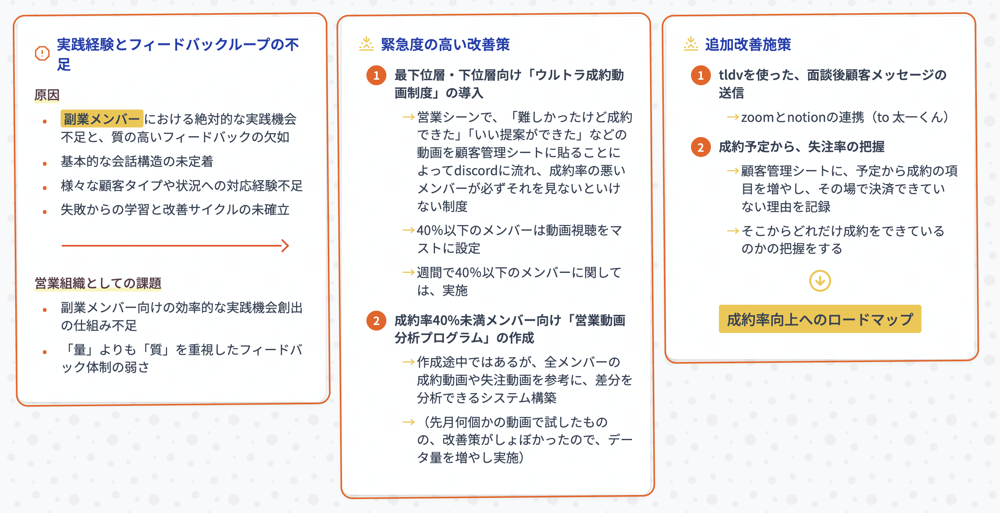

# 凪さん「営業チーム」

**種類**: 📄 ページ
**階層**: 3
**更新日時**: 2026-01-14 12:09

---

## コンテンツ

### 実践経験とフィードバックループの不足
- **原因**: 特に副業メンバーにおける絶対的な実践機会不足と、質の高いフィードバックの欠如
- 基本的な会話構造の未定着
- 様々な顧客タイプや状況への対応経験不足
- 失敗からの学習と改善サイクルの未確立
- **営業組織としての課題**: 副業メンバー向けの効率的な実践機会創出の仕組み不足
- 副業メンバー向けの効率的な実践機会創出の仕組み不足
- 「量」よりも「質」を重視したフィードバック体制の弱さ
### 緊急度の高い改善策
1. **最下位層・下位層向け「ウルトラ成約動画制度」の導入**
1. 営業シーンで、「難しかったけど成約できた」「いい提案ができた」などの動画を顧客管理シートに貼ることによってdiscordに流れ
成約率の悪いメンバーが必ずそれを見ないといけない制度（読了報告みたいな感じ）
1. 40％以下のメンバーは動画視聴をマストに設定
1. 週間で40％以下のメンバーに関しては、実施
1. **成約率40%未満メンバー向け「営業動画分析プログラム」の作成**
1. 作成途中ではあるが、全メンバーの成約動画や失注動画を参考に、差分を分析できるシステム構築
（先月何個かの動画で試したものの、改善策がしょぼかったので、データ量を増やし実施）
1. tldvを使った、面談後顧客メッセージの送信
1. zoomとnotionの連携できればお願いします！（to 太一くん）
1. 成約予定から、どれくらい失注しているのかの把握
1. 顧客管理シートに、予定から成約の項目を増やし、その場で決済できていない理由や
そこからどれだけ成約をできているのかの把握をする

---

## 子要素一覧

(子要素なし)

---
*Generated: 2026-01-14 12:09*
