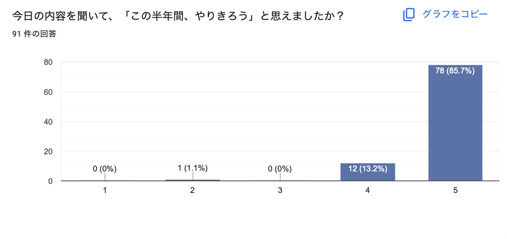
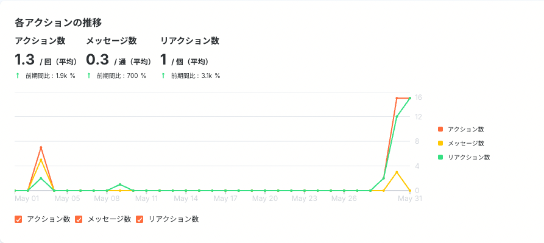

# あかね「CS」

**種類**: 📄 ページ
**階層**: 3
**更新日時**: 2026-01-14 12:09

---

## コンテンツ

# 先月目標と結果
---

📊 **Untitled** (データベース)
# KSF・転用AP

## ◆結果
## **クーリングオフ率　****4.33%****　＜（1月〜4月平均：5.54%）　****達成**
- クーリングオフ人数：**9人**　/     成約人数：**208人　（5月〜6月3日）**
📊 **クーリングオフ要因** (データベース)
## ◆要因
- 入学式の毎日開催を導入したこと
- Discord入室完了後に入学式案内
- **Discord入室完了者148人　→　入学式申込者144人　（**6月3日時点）
- **入学式参加者数98人（6月3日時点）うち、クーリングオフ1人（外れ値）**
- 原因は生徒様の事情のため、外れ値（母の病気の治療へのサポートもあり、大切な時期なので半年間つぎ込むのにも厳しいタイミング）
- 入学式参加による、仲間とのつながりで不安の払拭がされた（下記アンケート参照）

入学式の満足度（平均4.64 / 5点）

半年間やりきろうと思えたか　（平均4.82 / 5点）

やることの全体像はつかめたか　（平均4.57 / 5点）

**※入学式アンケート回答　**[**https://docs.google.com/forms/d/1eJtSNzoperKh9eQ0orJ3M3URb-hXwmdskJGkvuo5cuQ/edit#responses**](https://docs.google.com/forms/d/1eJtSNzoperKh9eQ0orJ3M3URb-hXwmdskJGkvuo5cuQ/edit#responses)
## **■満足度が高かった理由**
**仲間とのつながり・安心感（約50票）**
- 「仲間ができた」「安心した」「みんなと話せた」が最多
- グループセッションで他の生徒さんの意見が聞けてモチベUP
- 「一人じゃない」と思えたことへの安心感が大きな満足要因
**参加型ワークでのアウトプット（約25票）**
- 「目標を口に出せた」「やる気が出た」「楽しかった」
- 意見交換を通して自分の考えが整理されたという声が多数
**今後の見通し立った・不安が解消（約20票）**
- 半年間の流れややるべきことが明確になった
- 「見通しが持てた」「不安がなくなった」
**運営対応・説明の分かりやすさ（約15票）**
- 「丁寧で安心した」「説明が分かりやすい」
- トラブル時の対応への好印象
## **■改善点・不満点**
**グループセッションの案内・進行に戸惑い（約5票）**
- 運営が入らない説明がなかった　→ マニュアル追加
**音声・Zoomトラブル（約5票）**
- 動画音声の不具合、接続ラグ、Zoomの不慣れ→zoom設定変更
**説明のスピード・重複感（約4票）**
- 「説明が早すぎる」「事前に見た内容が多かった」など

# KFF・改善AP
---

## ◆結果
## **万垢率　5月****11.9%****　＞　4月14.2%　****未達**
**5月万垢達成者　19名うち（卒業生4名 / 現役生15名）**
📊 **万垢達成者** (データベース)
**⏰平均：165日（5.4ヶ月）**
## ◆要因
- 現役生

**💡40日＝万垢達成者の初投稿までの平均　中央値→30**
- 卒業時に30投稿している率の低下
→地域別、フォロワー別部屋の作成で交流・相談・オン会機会作り
→ジャンル特化グルコンの導入で、他講師からも質問を受けられる機会作り
📊 **Untitled** (データベース)

- 卒業生
- 卒業後に、スクラブを活用できていない

卒業部屋の現状

## ◆改善AP
- ジャンル特化グルコンなどのスクラブオンラインイベントは、卒業部屋でも周知する
- zoom参加者に、表示名の変更をお願いする
- お名前＋現役生の方はクラス名、卒業生の方は卒業生と記載してください
- ジャンル特化グルコンで質問回答もらったことをアウトプットする
- 卒業生限定オン会の開催とアンケートでニーズ確認
- 卒業後の万垢達成者を活用する

# 当月目標・達成AP

達成APとは

立てた目標を達成するためのアクションプランを納期付きで設定してください。
---

## ◆当月目標
## **卒業生グルコン参加率 　****20％以上**

## ◆達成AP
- ジャンル特グルコンの周知を卒業部屋にする （6/8の今月初回グルコン〜）
- 運営LINE、クラスチャットを活用して、卒業生を再びDiscordに呼び戻す （6/8の今月初回グルコン〜）
- 卒業生限定オン会の開催とアンケートでニーズ確認
- 1週目 日程決め
- 2週目〜4週目　2回開催
- グルコンでの学びをクラスチャットや卒業部屋にアウトプットするgive文化作り
- 卒業後万垢達している生徒にヒアリングする

# 議事録
---

---

## 子要素一覧

- 📊 [Untitled](./Untitled/index.md)

---

## 全子孫構造

このセクション配下の全ページ/データベース（1件）:

  - 📊 Untitled

---
*Generated: 2026-01-14 12:09*
