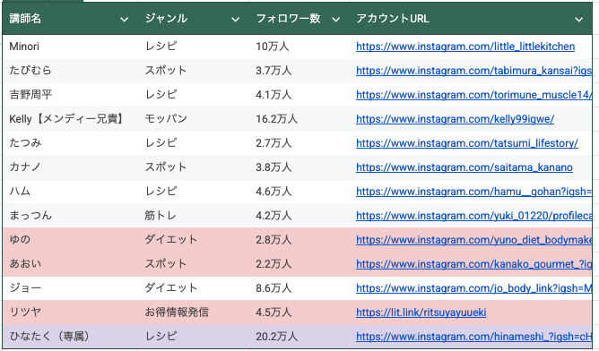

# けいいち「講師採用」

**種類**: 📄 ページ
**階層**: 3
**更新日時**: 2026-01-14 12:09

---

## コンテンツ

# 先月目標と結果
---

送信シート
[https://docs.google.com/spreadsheets/d/128klC6dtqw9dpHPT6DBemDtmHR4RUPmGty8jeHnjTG0/edit?gid=981844891#gid=981844891](https://docs.google.com/spreadsheets/d/128klC6dtqw9dpHPT6DBemDtmHR4RUPmGty8jeHnjTG0/edit?gid=981844891#gid=981844891)
面談者シート
[https://docs.google.com/spreadsheets/d/1QjidPdme9r3Ewbw5635mj7ZjNn9tQpBfwVYxSlv1Nm0/edit?gid=808892775#gid=808892775](https://docs.google.com/spreadsheets/d/1QjidPdme9r3Ewbw5635mj7ZjNn9tQpBfwVYxSlv1Nm0/edit?gid=808892775#gid=808892775)
3期目講師採用シート
[https://docs.google.com/spreadsheets/d/1-XFw8iAYV8N7CYw5GYIdxoBg5ws1l1rvNzK0hihR5qQ/edit?gid=1852766439#gid=1852766439](https://docs.google.com/spreadsheets/d/1-XFw8iAYV8N7CYw5GYIdxoBg5ws1l1rvNzK0hihR5qQ/edit?gid=1852766439#gid=1852766439)
## 目標
### オンライン講師採用：10名
### オフライン講師採用：1名
## 結果
### 講師採用：13名（内オフライン3名）→達成

※オフラインが赤色

採用講師内訳

[テーブル]
[table_row]
[table_row]
[table_row]
[table_row]
[table_row]
[table_row]
[table_row]
[table_row]
[table_row]
[table_row]
[table_row]
[table_row]
[table_row]
---

### 【DM営業経由】

今回数値（5月）

DM送付数：844件
反応数　　：35件（4.1％）
面談申込数：29件（82.8％）
面談実施数：21件（72％）
採用数　　：10件（47.6％）
※採用数は前月繰越分も含む

設定基準値

反応率：8%
申込率：60％
実施率：80%
採用率：35%

4月数値（参考）

DM送付数：1198件
反応数　　：59件（4.9％）
面談申込数：44件（75％）
面談実施数：35件（80％）
採用数　　：10人（29％）

### 【FCチャンネル経由】

[https://youtu.be/PbowAqGAZco?si=j1RrVubndTkphYfi](https://youtu.be/PbowAqGAZco?si=j1RrVubndTkphYfi)

内訳

フォーム回答数：20件
面談打診数：2件
面談申込数：2件
面談実施数：2件
採用数　　：2件
※内1人がオフライン出勤可能講師
Kelly【メンディー兄貴】モッパン16.2万人[https://www.instagram.com/kelly99igwe/](https://www.instagram.com/kelly99igwe/)
リツヤお得情報発信4.5万人[https://lit.link/ritsuyayuueki](https://lit.link/ritsuyayuueki)
# KSF・転用AP

KSFとは

KSFは「Key Success Factors（キーサクセスファクター）」の略で、日本語では「重要成功要因」と訳されます。KSFは、組織やビジネスが成功するために不可欠な要素や条件を指します。

転用AP　（アクションプラン）とは

KSFを受けて、再現性を持って取り組めるアクションプランを書き出してください

書き方の例

### 結果
ローンチ反応率1.11%（平均0.6%）
### 要因
- ストーリー閲覧率が平均40~50%と高水準だった。
└ストーリーで毎日フォロワーが興味を持ちやすいMBTIに絡めた投稿を1日3〜4投稿していた。
- フィード投稿を普段から投稿しており、平均いいね数が2000程度になっており、「フィード投稿で発信する人」という文化形成がなされており、フィードでのローンチと相性が良かった可能性がある
### AP
週３以上でメニーチャットを絡めた交流ストーリーを推奨する
普段リールでの発信が多い発信者はリールでローンチさせてみる
---
### 結果
- 採用率47.6％（4月：29％）
### 要因
- 不採用者との面談が少なくなるように、リスト作成・DM送信時のルールを動画で共有した
- 辞退時のアーカイブを確認し、辞退理由への対処法を分析およびアウト返しを増やした
## AP
- ルールを実行できているか毎週確認する
- トークスクリプトをアップデートし、引き継ぎで再現性を持たせるようにする
- 「他サービス卒業生で恩がある」
└在籍講師の9割が弊社サービスの卒業生以外です　これまでの経験が活かせるなど
- 「自身でコンテンツの販売をしている（今後したい）」
└自身の事業にローンチの経験が活かせて、実際に在籍講師も収益が増えている　など

# KFF・改善AP

KFFとは

KFF（Key Failure Factors）とは、組織やビジネスが失敗する原因となる重要な要素や条件を指します。これらは、成功を妨げるリスクや障害となる要因であり、企業が目標を達成できない理由を明らかにするために分析されます。

改善APとは

KFFを受けて、同じ失敗を繰り返さないためにどうするべきか？というアクションプランを書き出してください
---
### 結果
- 反応率4.1％（4月4.9％）
### 要因
- メンバーの管理不足
- インターン生（ゆりなさん）の離脱
- クラウドワークス
- 送信リストおよび投稿文章の分析不足
- リスト作成を3万フォロワー以上に限定していることで、途中契約破棄および進捗速度の低下（クラウドワークス）
- 依頼人数を増やすことで対応中
- メンバー離脱などが生じたことで、週次MTGなどの開催が延期
## AP
- 新メンバーと定例MTGを実施して、目標値設定、現状把握、AP設定を行う
- マイさんに新規で依頼（済）
# 当月目標・達成AP

達成APとは

立てた目標を達成するためのアクションプランを納期付きで設定してください。
---
## 目標
### 講師採用：10名

※各月9人新規採用で計算→予想流入数（新規）の箇所

6月採用は8月ローンチ実施
新規講師184流入（5月初回ローンチ実施講師の平均値）
と仮定
↓
8月成約目標：201件
必要流入数（12億円）：5,890（15億円：7,091）
既存講師見込み流入数：4984（4ヶ月毎の実施率を80％と仮定）
新規講師必要流入数：906（15億円：2,107）
必要講師数：5人（15億円：11人）

3期目4Qで15億円達成なら、21人の講師を直近3ヶ月で採用する必要あり
## 達成AP
- **DM送信数を月892件（6月中）**
┗反応数：44件（5％、前月：4.1％）
　申込数：31件（70％、前月：82.8％）
　実施数：25件（80％、前月：72％）
　採用数：10人（40％、前月：47.6％）
- SnsClub万垢部屋での講師募集および個別オファー（6月勉強会終了後）
- カイシャインさんYouTubeコラボ動画での講師募集
- 広告やコラボYouTubeからの流入も考慮して、専属講師の採用
- 過去面談時に集客不可と回答された講師へ打診（今月2名Zoom予定）
- 教育体制を確立させ、既存→専属講師への配置移動
- 既存講師MGのリソース確保

---

## 子要素一覧

(子要素なし)

---
*Generated: 2026-01-14 12:09*
