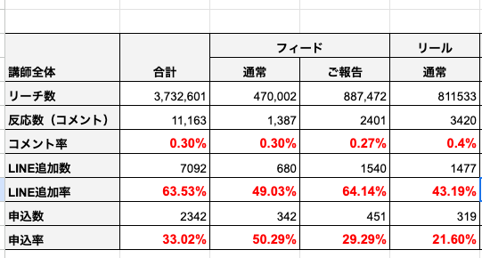
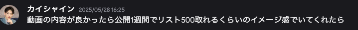

# 村松「講師マネージャー」

**種類**: 📄 ページ
**階層**: 3
**更新日時**: 2026-01-14 12:09

---

## コンテンツ

## 目標
**12億目標**
LINE流入：4689人
勉強会申込数：1492人
勉強会申込率：35％　　
**15億目標**
LINE流入：5645件
勉強会申込数：2089件
勉強会申込率：38％
ローンチ実施予定講師数：14人
## 結果
### リアルセミナーのみ
LINE流入：8082人（達成）
勉強会申込数：2951人 （達成）
勉強会申込率：38% （達成）
※初回申込でLIVE日程に申込した人
### 視聴会分も含む場合
勉強会申込数：3779人
勉強会申込率：47%
※**「達成」**は赤、**「未達」**は青

各講師ごとの細かい数値はこちらに記載しております↓
[https://docs.google.com/spreadsheets/d/1Ozpi1iHwWOxx0kGBgvReKkzCy8ERMA-YJVZsDLwrDB8/edit?usp=sharing](https://docs.google.com/spreadsheets/d/1O41qkEyplVzBTvXWto2BuygDDO-nFkjH_clUK5Pv8Vk/edit?usp=sharing)
# KSF・転用AP

KSFとは

KSFは「Key Success Factors（キーサクセスファクター）」の略で、日本語では「重要成功要因」と訳されます。KSFは、組織やビジネスが成功するために不可欠な要素や条件を指します。

転用AP　（アクションプラン）とは

KSFを受けて、再現性を持って取り組めるアクションプランを書き出してください

書き方の例

### 結果
ローンチ反応率1.11%（平均0.6%）
### 要因
- ストーリー閲覧率が平均40~50%と高水準だった。
└ストーリーで毎日フォロワーが興味を持ちやすいMBTIに絡めた投稿を1日3〜4投稿していた。
- フィード投稿を普段から投稿しており、平均いいね数が2000程度になっており、「フィード投稿で発信する人」という文化形成がなされており、フィードでのローンチと相性が良かった可能性がある
### AP
週３以上でメニーチャットを絡めた交流ストーリーを推奨する
普段リールでの発信が多い発信者はリールでローンチさせてみる
---
## 結果
**勉強会申込率：38%（****+3%****）**
※（）内は基準値比
## 要因
### ローンチ投稿の1本目をフィードに統一した
- 4月ローンチの分析結果よりリーチ数に対しての申込数が一番多かった「通常フィード」をローンチ投稿1本目として全講師統一で実施したことにより熱量の高いうちに申し込みを獲得できた
【4月の投稿別数値】

→リーチに対しての申込数
┗通常フィード：リーチ数10000に対して申込7.3件
┗ご報告フィード：リーチ数10000に対して申込5.1件
┗通常リール：リーチ数10000に対して申込3.9件

- また結果として、全体申込数2951件のうちの約32％である943件を1投稿目で獲得でき、熱量の高い初日に1投稿目としてをリールにしていた4月ローンチよりも5月の1投稿目の方が倍近くの申込率となった
【4月ローンチ1投稿目リールと5月ローンチ1投稿目フィードの比較】
[テーブル]
[table_row]
[table_row]
[table_row]
[table_row]
【通常フィード事例(あみりさん)】
[https://drive.google.com/drive/folders/1Co35U230Br0gG_YdKTGrNjSaz44_m92c](https://drive.google.com/drive/folders/1Co35U230Br0gG_YdKTGrNjSaz44_m92c)
## 転用AP
### ローンチ投稿の1本目をフィードに統一した
- リーチ数に対しての申込数は4月と5月ともに「通常フィード＞ご報告フィード＞リール」であるため、1投稿目は通常フィードでの統一は継続しつつ、2投稿目は「ご報告フィード投稿」で統一して全体での申込数をさらに底上げする

# KFF・改善AP

KFFとは

KFF（Key Failure Factors）とは、組織やビジネスが失敗する原因となる重要な要素や条件を指します。これらは、成功を妨げるリスクや障害となる要因であり、企業が目標を達成できない理由を明らかにするために分析されます。

改善APとは

KFFを受けて、同じ失敗を繰り返さないためにどうするべきか？というアクションプランを書き出してください
---
## 結果
講師MG間での申込数の達成率に最大150％の差が出ていた
【講師MG別達成率】

※**「達成」**は赤、**「未達」**は青

# 当月目標・達成AP

達成APとは

立てた目標を達成するためのアクションプランを納期付きで設定してください。
---
## 目標
### LINE流入：4689件
### 勉強会申込数：1492件
**12億目標**
LINE流入：4689件
勉強会申込数：1492件
勉強会申込率：35％　　
**15億目標**
LINE流入：5645件
勉強会申込数：2089件
勉強会申込率：37％
## 見込み数
LINE流入：2872件
勉強会申込数：1128件
勉強会申込率：37％
ローンチ講師数：14名
┗2月後半ローンチ組がローンチ周期の関係で7月ローンチに流れたため、その分7月が現場で27名と多くなっている
→**クオーターで見て判断して達成できるようにあらかじめ5月と7月の申込が多くなるよう調整しているので問題ない**
（6月の見込みは計画通り）
┗カイシャインさんは500流入、250申込計算

## 達成AP
- 1投稿目「通常フィード」→2投稿「ご報告フィード」→3投稿目「通常リール」の順番でリーチ数あたりの申込数が多い投稿から実施
- 勉強会メインのローンチクリエイティブに全講師統一
- 5月ローンチでふみやさんが実施したヒーローズジャーニー形式のフィード投稿を「講師側が過去を公開することに抵抗がない、物語としてインパクトのある過去を記載できる」などの条件に当てはまる講師のみで検証
- 一斉配信チャンネルで訴求
- ローンチ日は4月と同様に勉強開始3日目
- 収益訴求（教育時＆ローンチ期間中）
- 講師MGの週次MGで進捗＆方針を常に確認

---

## 子要素一覧

(子要素なし)

---
*Generated: 2026-01-14 12:09*
