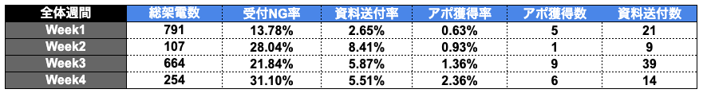

# 凪「ASP」

**種類**: 📄 ページ
**階層**: 3
**更新日時**: 2026-01-14 12:09

---

## コンテンツ

# 先月目標と結果
---
### **目標：6月300万円（0円未達）**
### **アポ獲得数：目標20件に対し、合計21件で達成**

### 【テレアポ・アポ実施進捗】
架電総数1816件、アポ獲得21件

◆アポ状況
・見込み    ：7件（案件化率33％）
・商談後失注    ：11件
・商談前    ：2件

◆アポ詳細
▼実施確定前
《株式会社ソーシャルテック》
・ステータス    ：施策確定前 (リスト送付済み)
・ネクスト    ：施策決定お戻し｜7/4(金)
《株式会社Beautick》
・ステータス    ：①施策実施確定お戻し / ②獲得系KOL提出
・ネクスト    ：①実施確定お戻し｜7/7週 / ②獲得提出｜7/2(水)
《株式会社SABON Japan》
・ステータス    ：お打ち合わせ商談待ち
・ネクスト    ：商談｜7/10(金)
《株式会社アンネルベッド》
・ステータス    ：公式アカウント依頼内容待ち
・ネクスト    ：希望施策内容お戻し
《株式会社クインス》
・ステータス    ：お打ち合わせ商談待ち
・ネクスト    ：先方商談日お戻し
▼インフルエンサーリスト送付前
《シチズン・システムズ株式会社》
・ステータス    ：YouTube Shortsリスト作成中
・ネクスト    ：リスト送付｜7/4(金)
《株式会社LADDER様》
・ステータス    ：インフルエンサーリスト作成
・ネクスト        ：獲得ブラ:リスト送付｜7/9(水)
—-------
◆撞い客必要
《株式会社チャコット》
・ステータス    ：リストお戻し
・ネクスト    ：実施可否リマインド予定｜6/27送付済み
《シンプルヒューマン》
・ステータス    ：リストお戻し待ち
・ネクスト    ：7月に再度追いかけ
《SARLISI株式会社》
・ステータス    ：お打ち合わせ商談待ち(社内承認前)
・ネクスト    ：追いかけ ※先方社内承認待ち
# KSF・改善AP

KSFとは

KFF（Key Failure Factors）とは、組織やビジネスが失敗する原因となる重要な要素や条件を指します。これらは、成功を妨げるリスクや障害となる要因であり、企業が目標を達成できない理由を明らかにするために分析されます。

改善APとは

KFFを受けて、同じ失敗を繰り返さないためにどうするべきか？というアクションプランを書き出してください
---
### **１、 業界シフトにより、案件質と量ともに大幅改善**
- しかし**案件化率が劇的改善**：見込み7件 + 商談進行中10件 = **合計17件の有望案件**
- 5月の加工食品業界での「予算30万円NG」問題が**解決済み**
1. **有名企業との商談実現**
- SABON Japan（グローバル美容ブランド）
- Beautick（美容系スタートアップ）
- チャコット（ダンス・バレエ業界大手）
1. **多様な業界への展開に成功**
- シチズン・システムズ（時計・精密機器）
- アンネルベッド（高級寝具）
- LADDER（アパレル・美容）
1. **案件進捗の健全化**
- 案件化：5件（SABON、Beautick等）
- リスト作成段階：2件（シチズン、LADDER）
- 追客継続：3件（チャコット等）
# KFF・改善AP

KFFとは

KFF（Key Failure Factors）とは、組織やビジネスが失敗する原因となる重要な要素や条件を指します。これらは、成功を妨げるリスクや障害となる要因であり、企業が目標を達成できない理由を明らかにするために分析されます。

改善APとは

KFFを受けて、同じ失敗を繰り返さないためにどうするべきか？というアクションプランを書き出してください
---

## 課題1：商談→受注プロセスの精度向上
### **現状の問題**
- **商談後失注：5件**
- **見込み案件：11件**
- **失注理由が不明で同じ失敗を繰り返すリスク**
### **具体的な課題**
- なぜ失注したのか？（価格・提案内容・競合比較）
- どの段階で案件が止まるのか？
- 成約する案件と失注する案件の違いは何か？
### **対策アクション**
1. 上記改善策として、安藤の時間も開くため自身でのアポ実施を想定
1. アポの録画を撮り、AIによって分析などを行い、次回のアポ獲得に活かす
---
## 🎯 課題2：パイプライン管理の仕組み化
### **現状の問題**
- **案件進捗が属人的で見えない（竹中との連携がスムーズではない）**
- **ネクストアクションの期限管理がバラバラ**
- **「お打ち合わせ商談待ち」「社内承認待ち」の実態不明**
### **具体的な課題**
- チャコット・シンプルヒューマン・SARLISIの追客タイミング最適化
- 有望案件（SABON・Beautick等）の進捗管理精度向上
- 案件の取りこぼし防止
### **対策アクション**
1. **案件ステータス定義の統一**
- 「商談確定」「提案済み」「決裁待ち」「追客中」等
1. **案件追いかけの仕組み**
- 安藤が顧客との間に入ることによって、各案件をいつまでにどう動かすかを決める
---
## 🎯 課題3：成功パターンの標準化と横展開
### **現状の問題**
- **美容系企業での成功事例はあるが再現性が不安定**
- **SABON・Beautick成功要因が暗黙知のまま**
- **他業界（精密機器・ライフスタイル）への展開方法が未確立**
### **具体的な課題**
- なぜSABON・Beautickは案件化したのか？
- シチズン・アンネルベッドの成功パターンは美容系と何が違うのか？
- 架電業者にどう教育すれば同じ成果が出るのか？
### **対策アクション**
1. **成功事例の要因分析**
- SABON・Beautick・シチズンのヒアリング内容整理
- 初回アプローチ～商談～受注までのプロセス明確化
- 現状は各企業に対してシュミレーションを出すことによって
費用対効果を目視で確認できることにより案件化率が高まっていると考える
1. **業界別営業マニュアル作成**
- 美容系・精密機器・ライフスタイル業界別のアプローチ方法

# 当月目標・達成AP

達成APとは

立てた目標を達成するためのアクションプランを納期付きで設定してください。
---
- 上記の改善策を実施し、7月の受注を目指す。
- 現状は1000コールを目処に依頼をしているが、ここを2000件などにして良いか
- また話は変わるが、運用代行のソーシング部隊を作成したほうがいいかを確認したい

---

## 子要素一覧

(子要素なし)

---
*Generated: 2026-01-14 12:09*
