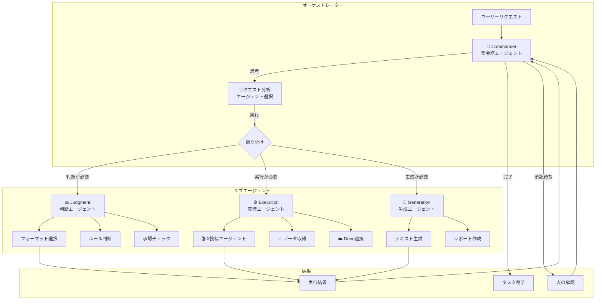
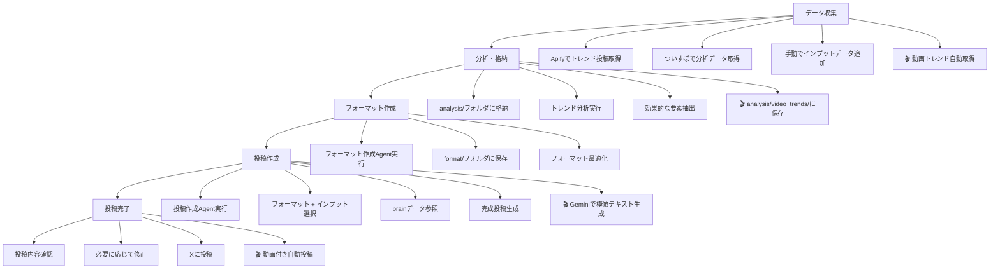

# Xポスト作成ツール ワークフロー

## マルチエージェントアーキテクチャ



## エージェント構成

| 区分 | 役割 | エージェント | 状態 |
|------|------|--------------|------|
| 司令塔 | 振り分け・制御 | CommanderAgent | ✅ 実装済み |
| 実行 | X投稿・データ取得 | XPostingAgent | ✅ 実装済み |
| 判断 | フォーマット選択 | FormatSelectorAgent | 🔜 予定 |
| 生成 | テキスト生成 | TextGeneratorAgent | 🔜 予定 |

## 起動トリガー

### イベントトリガー（最優先）
- Slackに投稿された → 司令塔起動
- LINEにメッセージが来た → 司令塔起動
- GitHub Actions定時実行 → 司令塔起動

### 定時トリガー
- 毎日9:00 JST: X投稿ワークフロー実行

### 手動トリガー
- `python orchestrator.py "リクエスト"`
- `python orchestrator.py --interactive`

---

## 第一階層ワークフロー



## 動画トレンドワークフロー (main.py)

```mermaid
flowchart TD
    subgraph Step1[Step 1: データ収集]
        S1A[Apify Tweet Scraper] --> S1B[@ManusAI_JP から取得]
        S1B --> S1C[動画付きツイート抽出]
    end

    subgraph Step2[Step 2: 分析・格納]
        S2A[analysis/video_trends/ に保存]
        S2B[JSON形式で生データ保存]
        S2C[サマリーテキスト生成]
    end

    subgraph Step3[Step 3: フォーマット選択]
        S3A[format/フォルダから読み込み]
        S3B[デフォルト: 05format-AI最新情報.md]
    end

    subgraph Step4[Step 4: スタイル参照]
        S4A[brain/フォルダから読み込み]
        S4B[過去の投稿スタイル適用]
    end

    subgraph Step5[Step 5: 投稿作成]
        S5A[動画ダウンロード]
        S5B[Geminiでテキスト生成]
        S5C[Google Driveにアップロード]
    end

    subgraph Step6[Step 6: 投稿完了]
        S6A[X APIで動画投稿]
        S6B[生成結果をJSONで保存]
    end

    Step1 --> Step2
    Step2 --> Step3
    Step3 --> Step4
    Step4 --> Step5
    Step5 --> Step6
```

## 詳細ワークフロー

### 1. データ収集フェーズ
- **Apify自動取得**: 毎日14:00にAI関連投稿を自動取得
- **ついすぽ分析**: エンゲージメント分析データを取得
- **手動データ追加**: input/フォルダに記事や情報を追加

### 2. 分析・格納フェーズ
- **analysis/フォルダ**: 取得したデータを整理・格納
- **トレンド分析**: 高エンゲージメント投稿の特徴を分析
- **効果的要素抽出**: バズる投稿の共通パターンを特定

### 3. フォーマット作成フェーズ
- **フォーマット作成Agent**: 分析データから新しいフォーマットを生成
- **format/フォルダ**: 作成したフォーマットを保存
- **フォーマット最適化**: 効果的な投稿フォーマットに調整

### 4. 投稿作成フェーズ
- **投稿作成Agent**: フォーマットとインプットを組み合わせて投稿を生成
- **フォーマット選択**: 目的に応じて適切なフォーマットを選択
- **インプット選択**: 投稿の元となるコンテンツを選択
- **brainデータ参照**: 過去の投稿スタイルを参考に一貫性を保持

### 5. 投稿完了フェーズ
- **投稿内容確認**: 生成された投稿内容を確認
- **必要に応じて修正**: 内容や表現を調整
- **Xに投稿**: 完成した投稿をXに投稿

## 使用可能なフォーマット

### 基本フォーマット
- 01format-base.md - 基本投稿フォーマット
- 01format-マグ式.md - マグネット効果のある投稿
- 02format-引用RT-base.md - 引用リツイート基本
- 02format-引用RT-強フック.md - 強フック引用RT
- 03format-ツリー---base.md - スレッド投稿用
- 04format-pre企画-広告用.md - 企画告知広告用
- 04format-pre企画用.md - 企画告知一般用

### AI関連フォーマット
- 05format-AI最新情報.md - AI最新情報投稿用
- 06format-AI技術解説.md - AI技術解説用
- 07format-AI実用例.md - AI実用例紹介用

### トレンドフォーマット
- 08format-共感型.md - 読者の共感を促す
- 09format-ノウハウ型.md - 実用的な価値を提供
- 10format-驚き型.md - 意外性で注意を引く
- 11format-ストーリー型.md - 個人的な体験談
- 12format-実績開示型.md - 具体的な数値で説得

## Agent使用方法

### 投稿作成Agent
```
@01agent-投稿作成.md [formatファイル] [inputファイル] [brainファイル（オプション）]
```

### フォーマット作成Agent
```
@02agent-format作成.md [analysisファイル] [フォーマット名] [フォーマットタイプ]
```

## 自動化設定

### 定期実行
- **頻度**: 毎日9:00 JST (0:00 UTC)
- **実行内容**: AI関連投稿の自動取得
- **保存先**: analysis/ai_trends/, analysis/video_trends/

### 手動実行
- **データ取得**: ./automation/ai_trends_fetcher.sh
- **データ処理**: automation/process_ai_data.py
- **投稿作成**: Agent呼び出し

## 動画トレンド自動取得 (main.py)

### コマンドラインオプション
```bash
# フォーマット一覧表示
python main.py --list-formats

# デフォルトフォーマットで実行（X投稿なし）
python main.py

# 特定のフォーマットを指定
python main.py --format "08format-共感型.md"

# X投稿を有効化
python main.py --post-to-x

# X投稿テスト（テキストのみ）
python main.py --test-x

# X投稿テスト（動画付き）
python main.py --test-x-video /path/to/video.mp4
```

### 出力ファイル
```
analysis/video_trends/
├── video_trends_ManusAI_JP_20250115.json      # 生データ
├── video_trends_ManusAI_JP_20250115_summary.txt  # サマリー
└── generated_posts_20250115.json              # 生成投稿
```

### GitHub Actions
- **ワークフロー**: .github/workflows/daily_agent.yml
- **スケジュール**: 毎日 0:00 UTC (9:00 JST)
- **手動実行**: workflow_dispatch から実行可能


